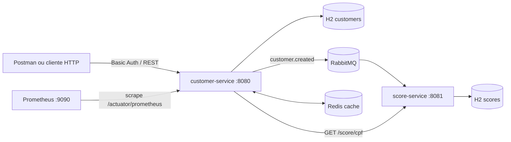

# Customer Manager

Solução do desafio técnico para gerenciamento de clientes, construída com Java 17, Spring Boot e Maven. A API permite cadastrar, atualizar, excluir, consultar e filtrar clientes, além de obter o score de crédito associado a cada CPF.

Além dos requisitos obrigatórios, a solução separa a geração de score em um segundo microsserviço e integra os serviços de forma assíncrona com RabbitMQ. As consultas de score são armazenadas em cache no Redis, os serviços e toda a infraestrutura são containerizados com Docker Compose e métricas da aplicação são expostas para o Prometheus.

## Como a solução atende ao desafio

- CRUD e filtros de clientes por nome e status através de uma API REST.
- Persistência em H2 com Spring Data JPA.
- Filtros dinâmicos implementados com `NamedParameterJdbcTemplate`.
- Atualização e exclusão implementadas com native queries.
- Integração HTTP entre o `customer-service` e o `score-service`.
- Tratamento de indisponibilidade, erro HTTP, timeout e resposta inválida do serviço de score.
- Validação de payload, CPF e e-mail, com respostas de erro padronizadas.
- Basic Authentication com os perfis `USER` e `ADMIN`.
- Testes unitários, de controller, segurança, repositórios, cliente HTTP e RabbitMQ.

## Arquitetura



Ao criar ou atualizar um cliente, o `customer-service` publica um evento `customer.created`. O `score-service` consome esse evento, gera um score entre 0 e 1000, calcula a classificação de risco e persiste o resultado. A consulta pública de score é feita pelo `customer-service`, que obtém o CPF do cliente e chama o serviço interno por HTTP. O resultado fica em cache no Redis por 5 minutos.

## Tecnologias

- Java 17
- Spring Boot 4.1
- Maven Wrapper
- Spring Web, Validation e RestClient
- Spring Security com Basic Authentication
- Spring Data JPA, JdbcTemplate e H2
- RabbitMQ
- Redis
- Spring Boot Actuator, Micrometer e Prometheus
- JUnit, Mockito, MockMvc e MockRestServiceServer
- Docker, Docker Compose e Make

## Requisitos para execução

Para executar todo o ambiente:

- Docker Engine ou Docker Desktop
- Docker Compose v2 (`docker compose`)
- GNU Make

Para executar os testes JUnit pelo Maven Wrapper também é necessário Java 17 ou superior. Não é necessário instalar Maven.

## Como iniciar

Na raiz do projeto, execute:

```bash
make up
```

O comando faz o build das imagens e inicia os dois serviços, RabbitMQ, Redis e Prometheus. Para acompanhar a inicialização:

```bash
make logs
```

Comandos úteis:

| Comando | Descrição |
|---|---|
| `make up` | Builda e inicia todo o ambiente |
| `make down` | Para e remove os containers |
| `make restart` | Reinicia todo o ambiente |
| `make build` | Builda as imagens usando cache |
| `make build-no-cache` | Refaz o build sem cache |
| `make logs-customer` | Exibe logs do customer-service e dependências |
| `make logs-score` | Exibe logs do score-service e RabbitMQ |
| `make clean` | Remove containers, volumes e órfãos |

Após a inicialização, a API fica disponível em `http://localhost:8080`.

## Segurança

Todos os endpoints de clientes exigem Basic Authentication. As credenciais padrão do ambiente Docker Compose são:

| Usuário | Senha | Permissões |
|---|---|---|
| `USER` | `user123` | Consultas (`GET`) |
| `ADMIN` | `admin123` | Consultas, criação, alteração e exclusão |

As senhas são externalizadas pelas variáveis `USER_PASSWORD` e `ADMIN_PASSWORD` e devem ser alteradas fora de um ambiente local.

## Endpoints disponíveis

Os endpoints públicos estão no `customer-service`:

| Método | Endpoint | Perfil | Descrição |
|---|---|---|---|
| `POST` | `/customer` | ADMIN | Cadastra um cliente |
| `PUT` | `/customer/{id}` | ADMIN | Atualiza um cliente |
| `DELETE` | `/customer/{id}` | ADMIN | Exclui um cliente |
| `GET` | `/customer/{id}` | USER ou ADMIN | Consulta um cliente por id |
| `GET` | `/customer` | USER ou ADMIN | Lista todos os clientes |
| `GET` | `/customer?name={name}` | USER ou ADMIN | Filtra por parte do nome, sem diferenciar maiúsculas e minúsculas |
| `GET` | `/customer?status=ACTIVE` | USER ou ADMIN | Filtra por status (`ACTIVE` ou `INACTIVE`) |
| `GET` | `/customer?name={name}&status={status}` | USER ou ADMIN | Combina os dois filtros |
| `GET` | `/customer/{id}/score` | USER ou ADMIN | Consulta o score do cliente |

O endpoint `GET /score/{cpf}` pertence ao `score-service` e é usado internamente pelo `customer-service`. No Docker Compose, o serviço fica isolado na rede de backend e não precisa ser chamado diretamente.

Endpoints de infraestrutura:

| URL | Descrição |
|---|---|
| `http://localhost:15672` | RabbitMQ Management (`guest` / `guest`) |
| `http://localhost:9090` | Prometheus |
| `http://localhost:8080/actuator/health` | Health check do customer-service |
| `http://localhost:8080/actuator/prometheus` | Métricas no formato Prometheus |
| `http://localhost:8080/h2-console` | Console H2 do customer-service |

## Exemplos de utilização

### Criar um cliente

```bash
curl --request POST 'http://localhost:8080/customer' \
  --user 'ADMIN:admin123' \
  --header 'Content-Type: application/json' \
  --data-raw '{
    "name": "Cliente Datum",
    "cpf": "63276284006",
    "email": "cliente@datum.com",
    "status": "ACTIVE"
  }'
```

Exemplo de resposta (`201 Created`):

```json
{
  "id": 1,
  "name": "Cliente Datum",
  "cpf": "63276284006",
  "email": "cliente@datum.com",
  "status": "ACTIVE"
}
```

### Consultar por id

```bash
curl --user 'USER:user123' 'http://localhost:8080/customer/1'
```

### Filtrar por nome e status

```bash
curl --user 'USER:user123' \
  'http://localhost:8080/customer?name=datum&status=ACTIVE'
```

### Atualizar um cliente

```bash
curl --request PUT 'http://localhost:8080/customer/1' \
  --user 'ADMIN:admin123' \
  --header 'Content-Type: application/json' \
  --data-raw '{
    "name": "Cliente Atualizado",
    "cpf": "63276284006",
    "email": "atualizado@datum.com",
    "status": "INACTIVE"
  }'
```

### Consultar o score

A criação do score é assíncrona. Após cadastrar o cliente, aguarde o processamento do evento pelo RabbitMQ e execute:

```bash
curl --user 'USER:user123' 'http://localhost:8080/customer/1/score'
```

Exemplo de resposta:

```json
{
  "cpf": "63276284006",
  "score": 750,
  "classification": "LOW_RISK"
}
```

Classificações possíveis:

| Faixa | Classificação |
|---|---|
| 0 a 499 | `HIGH_RISK` |
| 500 a 699 | `MEDIUM_RISK` |
| 700 a 1000 | `LOW_RISK` |

### Excluir um cliente

```bash
curl --request DELETE \
  --user 'ADMIN:admin123' \
  'http://localhost:8080/customer/1'
```

## Como testar

### Suíte completa pelo Makefile

Com Java 17, Docker e Make disponíveis:

```bash
make test
```

O alvo inicia o RabbitMQ, executa os testes dos dois serviços e encerra o ambiente. A suíte cobre:

- regras de criação, atualização, exclusão, busca e filtros;
- normalização e validação de CPF;
- conflitos de CPF e e-mail;
- persistência JPA, restrições de unicidade, JdbcTemplate e native queries no H2;
- geração, persistência e classificação de score;
- controllers e mapeamento de respostas HTTP;
- Basic Authentication e autorização dos perfis USER e ADMIN;
- cliente HTTP em sucesso, erro 503, timeout e JSON inesperado;
- publicação e consumo reais de eventos no RabbitMQ.

No total, são 64 testes automatizados: 48 no `customer-service` e 16 no `score-service`.

Para testá-los separadamente, rode:

```bash
make test-customer
# OU
make test-score
```

### Testes manuais com Postman

1. Inicie o ambiente com `make up`.
2. Importe o arquivo `postman_collection.json` no Postman.
3. Preencha a senha de cada request conforme o usuário configurado.
4. Execute primeiro `Create customer` e depois as consultas, atualização e exclusão.

## Configurações

O Docker Compose já fornece as configurações necessárias. Para execução fora dele, configure:

| Variável | Finalidade | Valor usado no Compose |
|---|---|---|
| `SCORE_SERVICE_BASE_URL` | URL interna do score-service | `http://score-service:8081` |
| `SPRING_RABBITMQ_HOST` | Host do RabbitMQ | `rabbitmq` |
| `SPRING_RABBITMQ_PORT` | Porta AMQP | `5672` |
| `SPRING_RABBITMQ_USERNAME` | Usuário do RabbitMQ | `guest` |
| `SPRING_RABBITMQ_PASSWORD` | Senha do RabbitMQ | `guest` |
| `SPRING_DATA_REDIS_HOST` | Host do Redis | `redis` |
| `SPRING_DATA_REDIS_PORT` | Porta do Redis | `6379` |
| `ADMIN_PASSWORD` | Senha do perfil ADMIN | `admin123` |
| `USER_PASSWORD` | Senha do perfil USER | `user123` |
| `SERVER_PORT` | Porta do score-service | `8081` |

Os timeouts do cliente HTTP ficam externalizados em `application.yml`: 5 segundos para conexão e 10 segundos para leitura.

## Respostas de erro

Os erros seguem uma estrutura única com timestamp, status HTTP, tipo, mensagem, caminho e detalhes de validação. Os principais status são:

| Status | Situação |
|---|---|
| `400 Bad Request` | Payload inválido |
| `401 Unauthorized` | Credenciais ausentes ou inválidas |
| `403 Forbidden` | Perfil sem permissão para a operação |
| `404 Not Found` | Cliente ou score não encontrado |
| `422 Unprocessable Entity` | CPF ou e-mail já cadastrado, ou falha de persistência tratada |
| `502 Bad Gateway` | Falha na comunicação com o score-service |
| `500 Internal Server Error` | Erro interno inesperado |

## Estrutura do projeto

```text
CustomerManager/
├── customer-service/       # API pública, segurança, clientes, cache e integração HTTP
├── score-service/          # geração, persistência e consulta de scores
├── prometheus/             # configuração de coleta de métricas
├── docker-compose.yml      # orquestração dos serviços e infraestrutura
├── Makefile                # comandos de execução, logs e testes
└── postman_collection.json # coleção para testes manuais
```
